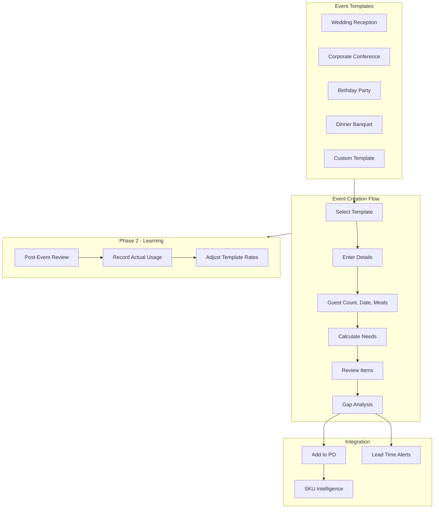
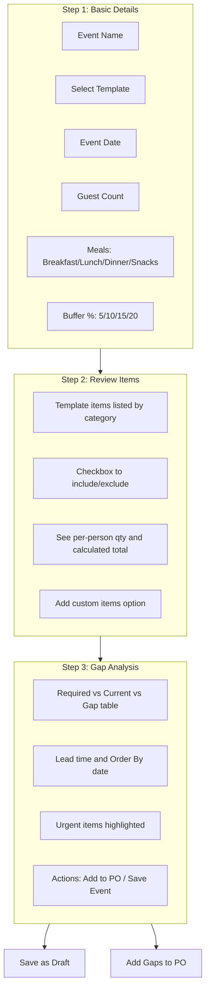

# Event-Based Emergency Orders Plan

## Overview

This feature helps hospitality businesses prepare inventory for upcoming events (weddings, conferences, parties) by:

1. Using pre-defined templates with per-person consumption rates
2. Auto-calculating required inventory based on guest count and meals
3. Identifying gaps between required and current stock
4. Alerting when order deadlines approach based on supplier lead times
5. Integrating with PO system for one-click ordering

---

## Architecture




---

## Phase 1: Manual Templates + Basic Calculation

### 1.1 New Pages


| Route                              | File                                               | Purpose                          |
| ---------------------------------- | -------------------------------------------------- | -------------------------------- |
| `/inventory/events`                | `src/app/inventory/events/page.tsx`                | Event list with status filters   |
| `/inventory/events/create`         | `src/app/inventory/events/create/page.tsx`         | Multi-step event creation wizard |
| `/inventory/events/[id]`           | `src/app/inventory/events/[id]/page.tsx`           | Event detail, gaps, linked POs   |
| `/inventory/events/templates`      | `src/app/inventory/events/templates/page.tsx`      | Manage event templates           |
| `/inventory/events/templates/[id]` | `src/app/inventory/events/templates/[id]/page.tsx` | Edit template items              |


### 1.2 New Module Structure

```
src/app/modules/inventory/events/
├── components/
│   ├── EventList.tsx              # List of all events with filters
│   ├── EventDetail.tsx            # Single event view with gaps
│   ├── EventCreateWizard.tsx      # Multi-step creation form
│   │   ├── Step1BasicDetails.tsx  # Name, template, date, guests
│   │   ├── Step2ReviewItems.tsx   # Customize items, exclude/include
│   │   └── Step3GapAnalysis.tsx   # Show gaps, order deadlines
│   ├── EventGapTable.tsx          # Required vs Current vs Gap
│   ├── EventStatusBadge.tsx       # Status indicator
│   ├── TemplateList.tsx           # List of templates
│   ├── TemplateEditor.tsx         # Edit template items
│   ├── TemplateItemRow.tsx        # Single item in template
│   ├── TemplateSelector.tsx       # Dropdown/cards for selection
│   ├── MealCheckboxes.tsx         # Breakfast/Lunch/Dinner/Snacks
│   └── OrderDeadlineAlert.tsx     # Warning for approaching deadlines
├── utils/
│   ├── eventsApi.ts               # Event CRUD operations
│   ├── templatesApi.ts            # Template CRUD operations
│   ├── eventCalculations.ts       # Core calculation logic
│   └── constants.ts               # Default templates, buffer rates
└── types/
    └── eventTypes.ts              # TypeScript interfaces
```

### 1.3 Database Schema

**Event Templates Collection:**

```typescript
// New: eventTemplates array in store object
interface EventTemplate {
  id: string;                        // "tpl-wedding"
  name: string;                      // "Wedding Reception"
  description: string;               // "Full wedding reception with meals"
  icon: string;                      // "wedding" or emoji "💒"
  isSystem: boolean;                 // true = pre-defined, false = user-created
  items: TemplateItem[];
  createdBy: string;
  createdAt: string;
  updatedAt: string;
}

interface TemplateItem {
  itemId: string;                    // Links to inventory item SKU
  itemName: string;                  // "Rice"
  category: string;                  // "Food", "Beverage", "Disposable"
  qtyPerPerson: number;              // 0.15 (kg per person)
  unit: string;                      // "kg", "L", "pieces"
  applicableMeals: string[];         // ["lunch", "dinner"] or ["all"]
  isOptional: boolean;               // User can exclude
  notes: string;                     // "Vegetarian option"
}
```

**Events Collection:**

```typescript
// New: events array in store object
interface Event {
  id: string;                        // "EVT-2026-001"
  name: string;                      // "Sharma-Gupta Wedding"
  templateId: string;                // "tpl-wedding"
  templateName: string;              // Denormalized for display
  
  // Event details
  date: string;                      // "2026-01-25"
  guestCount: number;                // 200
  mealsIncluded: string[];           // ["lunch", "dinner", "snacks"]
  bufferPercent: number;             // 10
  
  // Customization
  excludedItemIds: string[];         // Items user unchecked
  customItems: EventCustomItem[];    // Extra items added
  
  // Calculated needs (snapshot at creation)
  calculatedNeeds: EventItemNeed[];
  
  // Ordering integration
  linkedPOIds: string[];             // POs created for this event
  
  // Status tracking
  status: "draft" | "confirmed" | "in-progress" | "completed" | "cancelled";
  
  // Metadata
  createdBy: string;
  createdAt: string;
  updatedAt: string;
  completedAt?: string;
}

interface EventCustomItem {
  itemId: string;
  itemName: string;
  quantity: number;
  unit: string;
  notes: string;
}

interface EventItemNeed {
  itemId: string;
  itemName: string;
  sku: string;
  category: string;
  unit: string;
  
  // Calculation breakdown
  qtyPerPerson: number;
  mealsApplied: number;
  bufferPercent: number;
  
  // Results
  requiredQty: number;
  currentStock: number;              // At time of calculation
  gap: number;
  
  // Ordering info
  leadTimeDays: number;
  orderByDate: string;
  isUrgent: boolean;                 // orderByDate within 2 days
  
  // Order status
  orderedQty: number;
  orderedInPOId: string | null;
}
```

### 1.4 Default Templates Data

Pre-populate with these system templates:

```typescript
// src/app/modules/inventory/events/utils/constants.ts

export const DEFAULT_TEMPLATES: EventTemplate[] = [
  {
    id: "tpl-wedding",
    name: "Wedding Reception",
    description: "Full wedding reception with meals and beverages",
    icon: "wedding",
    isSystem: true,
    items: [
      // FOOD - Main Course
      { itemId: "", itemName: "Rice", category: "Food", qtyPerPerson: 0.15, unit: "kg", applicableMeals: ["lunch", "dinner"], isOptional: false, notes: "" },
      { itemId: "", itemName: "Mixed Vegetables", category: "Food", qtyPerPerson: 0.2, unit: "kg", applicableMeals: ["lunch", "dinner"], isOptional: false, notes: "" },
      { itemId: "", itemName: "Chicken", category: "Food", qtyPerPerson: 0.15, unit: "kg", applicableMeals: ["lunch", "dinner"], isOptional: true, notes: "Non-veg option" },
      { itemId: "", itemName: "Paneer", category: "Food", qtyPerPerson: 0.1, unit: "kg", applicableMeals: ["lunch", "dinner"], isOptional: true, notes: "Veg option" },
      { itemId: "", itemName: "Dal", category: "Food", qtyPerPerson: 0.1, unit: "kg", applicableMeals: ["lunch", "dinner"], isOptional: false, notes: "" },
      { itemId: "", itemName: "Bread/Roti", category: "Food", qtyPerPerson: 3, unit: "pieces", applicableMeals: ["lunch", "dinner"], isOptional: false, notes: "" },
      { itemId: "", itemName: "Dessert/Sweets", category: "Food", qtyPerPerson: 0.1, unit: "kg", applicableMeals: ["lunch", "dinner"], isOptional: false, notes: "" },
      // BEVERAGES
      { itemId: "", itemName: "Soft Drinks", category: "Beverage", qtyPerPerson: 0.3, unit: "L", applicableMeals: ["all"], isOptional: false, notes: "" },
      { itemId: "", itemName: "Water Bottles", category: "Beverage", qtyPerPerson: 1, unit: "pieces", applicableMeals: ["all"], isOptional: false, notes: "" },
      { itemId: "", itemName: "Juice", category: "Beverage", qtyPerPerson: 0.2, unit: "L", applicableMeals: ["all"], isOptional: true, notes: "" },
      // DISPOSABLES
      { itemId: "", itemName: "Plates", category: "Disposable", qtyPerPerson: 2, unit: "pieces", applicableMeals: ["all"], isOptional: false, notes: "" },
      { itemId: "", itemName: "Napkins", category: "Disposable", qtyPerPerson: 4, unit: "pieces", applicableMeals: ["all"], isOptional: false, notes: "" },
      { itemId: "", itemName: "Cups", category: "Disposable", qtyPerPerson: 2, unit: "pieces", applicableMeals: ["all"], isOptional: false, notes: "" },
      { itemId: "", itemName: "Spoons", category: "Disposable", qtyPerPerson: 2, unit: "pieces", applicableMeals: ["all"], isOptional: false, notes: "" },
    ]
  },
  {
    id: "tpl-conference",
    name: "Corporate Conference",
    description: "Business meeting with tea/coffee and snacks",
    icon: "business",
    isSystem: true,
    items: [
      { itemId: "", itemName: "Tea/Coffee", category: "Beverage", qtyPerPerson: 0.3, unit: "L", applicableMeals: ["snacks"], isOptional: false, notes: "Per session" },
      { itemId: "", itemName: "Biscuits", category: "Food", qtyPerPerson: 0.05, unit: "kg", applicableMeals: ["snacks"], isOptional: false, notes: "" },
      { itemId: "", itemName: "Water Bottles", category: "Beverage", qtyPerPerson: 2, unit: "pieces", applicableMeals: ["all"], isOptional: false, notes: "" },
      { itemId: "", itemName: "Notepad", category: "Stationery", qtyPerPerson: 1, unit: "pieces", applicableMeals: ["all"], isOptional: true, notes: "" },
      { itemId: "", itemName: "Pen", category: "Stationery", qtyPerPerson: 1, unit: "pieces", applicableMeals: ["all"], isOptional: true, notes: "" },
    ]
  },
  {
    id: "tpl-birthday",
    name: "Birthday Party",
    description: "Small celebration with cake and snacks",
    icon: "cake",
    isSystem: true,
    items: [
      { itemId: "", itemName: "Cake", category: "Food", qtyPerPerson: 0.1, unit: "kg", applicableMeals: ["all"], isOptional: false, notes: "1kg per 10 guests" },
      { itemId: "", itemName: "Soft Drinks", category: "Beverage", qtyPerPerson: 0.5, unit: "L", applicableMeals: ["all"], isOptional: false, notes: "" },
      { itemId: "", itemName: "Snacks/Chips", category: "Food", qtyPerPerson: 0.1, unit: "kg", applicableMeals: ["all"], isOptional: false, notes: "" },
      { itemId: "", itemName: "Plates", category: "Disposable", qtyPerPerson: 2, unit: "pieces", applicableMeals: ["all"], isOptional: false, notes: "" },
      { itemId: "", itemName: "Napkins", category: "Disposable", qtyPerPerson: 3, unit: "pieces", applicableMeals: ["all"], isOptional: false, notes: "" },
      { itemId: "", itemName: "Cups", category: "Disposable", qtyPerPerson: 2, unit: "pieces", applicableMeals: ["all"], isOptional: false, notes: "" },
    ]
  },
  {
    id: "tpl-banquet",
    name: "Dinner Banquet",
    description: "Formal dinner event",
    icon: "dinner",
    isSystem: true,
    items: [
      { itemId: "", itemName: "Rice", category: "Food", qtyPerPerson: 0.15, unit: "kg", applicableMeals: ["dinner"], isOptional: false, notes: "" },
      { itemId: "", itemName: "Main Course Veg", category: "Food", qtyPerPerson: 0.2, unit: "kg", applicableMeals: ["dinner"], isOptional: false, notes: "" },
      { itemId: "", itemName: "Main Course Non-Veg", category: "Food", qtyPerPerson: 0.15, unit: "kg", applicableMeals: ["dinner"], isOptional: true, notes: "" },
      { itemId: "", itemName: "Dessert", category: "Food", qtyPerPerson: 0.1, unit: "kg", applicableMeals: ["dinner"], isOptional: false, notes: "" },
      { itemId: "", itemName: "Soft Drinks", category: "Beverage", qtyPerPerson: 0.3, unit: "L", applicableMeals: ["dinner"], isOptional: false, notes: "" },
      { itemId: "", itemName: "Water", category: "Beverage", qtyPerPerson: 0.5, unit: "L", applicableMeals: ["dinner"], isOptional: false, notes: "" },
    ]
  },
  {
    id: "tpl-room-block",
    name: "Room Block",
    description: "Group hotel booking amenities",
    icon: "hotel",
    isSystem: true,
    items: [
      { itemId: "", itemName: "Towels Set", category: "Linen", qtyPerPerson: 1, unit: "set", applicableMeals: ["all"], isOptional: false, notes: "Per room" },
      { itemId: "", itemName: "Toiletries Kit", category: "Amenity", qtyPerPerson: 1, unit: "kit", applicableMeals: ["all"], isOptional: false, notes: "Per room" },
      { itemId: "", itemName: "Water Bottles", category: "Beverage", qtyPerPerson: 2, unit: "pieces", applicableMeals: ["all"], isOptional: false, notes: "Per room per day" },
      { itemId: "", itemName: "Tea/Coffee Sachets", category: "Beverage", qtyPerPerson: 4, unit: "pieces", applicableMeals: ["all"], isOptional: false, notes: "Per room" },
    ]
  }
];

export const BUFFER_PERCENT_OPTIONS = [5, 10, 15, 20];
export const DEFAULT_BUFFER_PERCENT = 10;
```

### 1.5 API Functions

**Events API** - `src/app/modules/inventory/events/utils/eventsApi.ts`:

```typescript
// Event CRUD
export async function createEvent(event: Omit<Event, "id" | "createdAt">): Promise<Event>
export async function getEvents(): Promise<Event[]>
export async function getEventById(id: string): Promise<Event | null>
export async function updateEvent(id: string, updates: Partial<Event>): Promise<boolean>
export async function deleteEvent(id: string): Promise<boolean>

// Status updates
export async function updateEventStatus(id: string, status: Event["status"]): Promise<boolean>
export async function linkPOToEvent(eventId: string, poId: string): Promise<boolean>

// Queries
export async function getUpcomingEvents(days?: number): Promise<Event[]>
export async function getEventsWithUrgentOrders(): Promise<Event[]>
```

**Templates API** - `src/app/modules/inventory/events/utils/templatesApi.ts`:

```typescript
// Template CRUD
export async function getTemplates(): Promise<EventTemplate[]>
export async function getTemplateById(id: string): Promise<EventTemplate | null>
export async function createTemplate(template: Omit<EventTemplate, "id" | "createdAt">): Promise<EventTemplate>
export async function updateTemplate(id: string, updates: Partial<EventTemplate>): Promise<boolean>
export async function deleteTemplate(id: string): Promise<boolean>

// Item linking
export async function linkTemplateItemToInventory(templateId: string, templateItemIndex: number, inventoryItemId: string): Promise<boolean>

// Initialize default templates
export async function initializeDefaultTemplates(): Promise<void>
```

**Calculations** - `src/app/modules/inventory/events/utils/eventCalculations.ts`:

```typescript
// Core calculation
export function calculateEventNeeds(
  event: Pick<Event, "guestCount" | "mealsIncluded" | "bufferPercent" | "excludedItemIds">,
  template: EventTemplate,
  currentInventory: InventoryItem[],
  skuIntelligence: SKUIntelligence
): EventItemNeed[]

// Individual item calculation
export function calculateItemNeed(
  templateItem: TemplateItem,
  guestCount: number,
  mealsIncluded: string[],
  bufferPercent: number,
  currentStock: number,
  leadTimeDays: number,
  eventDate: Date
): EventItemNeed

// Gap analysis
export function getItemsWithGaps(needs: EventItemNeed[]): EventItemNeed[]
export function getUrgentItems(needs: EventItemNeed[], today: Date): EventItemNeed[]

// Order deadline calculation
export function calculateOrderByDate(eventDate: Date, leadTimeDays: number, bufferDays?: number): Date
export function getDaysUntilDeadline(orderByDate: Date, today: Date): number
```

### 1.6 Event Creation Wizard Flow




### 1.7 Dashboard Integration

Add to [store.tsx](src/app/modules/inventory/store/components/store.tsx):

**New Metric Card:**

```
Upcoming Events: [count]
- Shows events in next 30 days
- Click navigates to /inventory/events
```

**Dashboard Widget:**

```
UPCOMING EVENTS
├── Sharma Wedding    | 25 Jan | 200 guests | 2 items urgent
├── Corporate Meet    | 28 Jan | 50 guests  | Ready
└── [+ Create Event]
```

**Alert Banner (if urgent):**

```
WARNING: Order deadline for "Sharma Wedding" items is tomorrow!
[View Event]
```

### 1.8 Alert System

**Daily Cron Check** - Add to existing cron or create `/api/cron/event-alerts`:

```typescript
export async function checkEventOrderDeadlines(): Promise<void> {
  const events = await getUpcomingEvents(30);
  
  for (const event of events) {
    for (const need of event.calculatedNeeds) {
      if (need.gap > 0 && need.orderedQty < need.gap) {
        const daysUntilDeadline = getDaysUntilDeadline(new Date(need.orderByDate), new Date());
        
        if (daysUntilDeadline <= 0) {
          // OVERDUE - Create critical alert
          await createAlert({
            type: "event-order-overdue",
            severity: "critical",
            eventId: event.id,
            itemId: need.itemId,
            message: `OVERDUE: ${need.itemName} for ${event.name} should have been ordered`
          });
        } else if (daysUntilDeadline <= 2) {
          // URGENT - Create high priority alert
          await createAlert({
            type: "event-order-urgent", 
            severity: "high",
            eventId: event.id,
            itemId: need.itemId,
            message: `Order ${need.itemName} for ${event.name} by ${need.orderByDate}`
          });
        }
      }
    }
  }
}
```

---

## Phase 2: Historical Learning (Future Enhancement)

### 2.1 Additional Database Schema

```typescript
// Add to Event interface
interface Event {
  // ... existing fields ...
  
  // Phase 2: Post-event tracking
  actualGuestCount?: number;
  actualUsage?: EventActualUsage[];
  accuracyScore?: number;            // How accurate was the prediction
}

interface EventActualUsage {
  itemId: string;
  itemName: string;
  orderedQty: number;
  usedQty: number;
  leftoverQty: number;
  accuracyPercent: number;           // usedQty / orderedQty * 100
}

// New: templateLearning to track historical accuracy
interface TemplateLearning {
  templateId: string;
  itemId: string;
  history: {
    eventId: string;
    eventDate: string;
    guestCount: number;
    expectedPerPerson: number;
    actualPerPerson: number;
    accuracy: number;
  }[];
  suggestedQtyPerPerson: number;     // Calculated from history
  adjustmentApplied: boolean;
}
```

### 2.2 Post-Event Review Component

New component: `PostEventReview.tsx`

```
POST-EVENT REVIEW: Sharma Wedding
───────────────────────────────────
Guests Attended: [185] (Expected: 200)
───────────────────────────────────
Item        | Ordered | Used  | Left | Accuracy
Rice        | 66kg    | 52kg  | 14kg | 79% (over-ordered)
Vegetables  | 88kg    | 80kg  | 8kg  | 91%
Chicken     | 66kg    | 70kg  | -4kg | 106% (shortage)
───────────────────────────────────
[Save Actuals] [Skip Review]
```

### 2.3 Learning Algorithm

```typescript
// After saving post-event data
export async function updateTemplateFromActual(
  event: Event,
  actualUsage: EventActualUsage[]
): Promise<void> {
  const template = await getTemplateById(event.templateId);
  
  for (const actual of actualUsage) {
    // Calculate actual per-person consumption
    const actualGuests = event.actualGuestCount || event.guestCount;
    const templateItem = template.items.find(i => i.itemId === actual.itemId);
    const mealsCount = getMealsCount(templateItem, event.mealsIncluded);
    const actualPerPerson = actual.usedQty / (actualGuests * mealsCount);
    
    // Store in learning history
    await addToLearningHistory(template.id, actual.itemId, {
      eventId: event.id,
      guestCount: actualGuests,
      expectedPerPerson: templateItem.qtyPerPerson,
      actualPerPerson,
      accuracy: actualPerPerson / templateItem.qtyPerPerson
    });
    
    // After 5+ events, suggest adjustment
    const history = await getLearningHistory(template.id, actual.itemId);
    if (history.length >= 5) {
      const avgActual = average(history.map(h => h.actualPerPerson));
      const currentEstimate = templateItem.qtyPerPerson;
      
      if (Math.abs(avgActual - currentEstimate) / currentEstimate > 0.1) {
        // Suggest adjustment if >10% difference
        await createSuggestion({
          templateId: template.id,
          itemId: actual.itemId,
          currentValue: currentEstimate,
          suggestedValue: avgActual,
          basedOnEvents: history.length
        });
      }
    }
  }
}
```

### 2.4 Phase 2 Additional Pages


| Route                                       | Purpose                       |
| ------------------------------------------- | ----------------------------- |
| `/inventory/events/[id]/review`             | Post-event actual usage entry |
| `/inventory/events/templates/[id]/insights` | View learning suggestions     |


---

## Implementation Order

```mermaid
gantt
    title Event-Based Orders Implementation
    dateFormat X
    axisFormat %s
    
    section Phase1_Foundation
    TypeScript Interfaces             :a1, 0, 1
    Database Schema                   :a2, 1, 2
    Default Templates Data            :a3, 2, 3
    
    section Phase1_API
    Templates API                     :b1, 3, 5
    Events API                        :b2, 5, 7
    Calculation Utils                 :b3, 7, 9
    
    section Phase1_UI
    Template Components               :c1, 9, 11
    Event Create Wizard               :c2, 11, 14
    Event List and Detail             :c3, 14, 16
    Gap Analysis Table                :c4, 16, 17
    
    section Phase1_Integration
    PO Integration                    :d1, 17, 18
    Dashboard Widget                  :d2, 18, 19
    Alert System                      :d3, 19, 20
    
    section Phase2_Learning
    Post-Event Review UI              :e1, 20, 22
    Learning Algorithm                :e2, 22, 24
    Template Insights                 :e3, 24, 26
```




---

## Files Summary

### New Files to Create

**Pages (7 new pages):**

- `src/app/inventory/events/page.tsx`
- `src/app/inventory/events/create/page.tsx`
- `src/app/inventory/events/[id]/page.tsx`
- `src/app/inventory/events/templates/page.tsx`
- `src/app/inventory/events/templates/[id]/page.tsx`
- `src/app/inventory/events/[id]/review/page.tsx` (Phase 2)
- `src/app/inventory/events/templates/[id]/insights/page.tsx` (Phase 2)

**Module Components (12+ components):**

- `src/app/modules/inventory/events/components/EventList.tsx`
- `src/app/modules/inventory/events/components/EventDetail.tsx`
- `src/app/modules/inventory/events/components/EventCreateWizard.tsx`
- `src/app/modules/inventory/events/components/EventGapTable.tsx`
- `src/app/modules/inventory/events/components/EventStatusBadge.tsx`
- `src/app/modules/inventory/events/components/TemplateList.tsx`
- `src/app/modules/inventory/events/components/TemplateEditor.tsx`
- `src/app/modules/inventory/events/components/TemplateSelector.tsx`
- `src/app/modules/inventory/events/components/MealCheckboxes.tsx`
- `src/app/modules/inventory/events/components/OrderDeadlineAlert.tsx`
- `src/app/modules/inventory/events/components/PostEventReview.tsx` (Phase 2)
- `src/app/modules/inventory/events/components/TemplateInsights.tsx` (Phase 2)

**Utilities (4 files):**

- `src/app/modules/inventory/events/utils/eventsApi.ts`
- `src/app/modules/inventory/events/utils/templatesApi.ts`
- `src/app/modules/inventory/events/utils/eventCalculations.ts`
- `src/app/modules/inventory/events/utils/constants.ts`

**Types (1 file):**

- `src/app/modules/inventory/events/types/eventTypes.ts`

### Files to Modify


| File                                                                                                           | Changes                                    |
| -------------------------------------------------------------------------------------------------------------- | ------------------------------------------ |
| [src/types/inventory.ts](src/types/inventory.ts)                                                               | Add Event, EventTemplate interfaces        |
| [src/app/modules/inventory/store/components/store.tsx](src/app/modules/inventory/store/components/store.tsx)   | Add Upcoming Events metric card and widget |
| [src/app/modules/inventory/store/utils/InventoryApi.ts](src/app/modules/inventory/store/utils/InventoryApi.ts) | Add function to fetch events and templates |


---

## Integration with Existing Features

### PO System Integration (Step 1)

When user clicks "Add Gaps to PO":

1. Get all items with gap > 0 from event
2. Group by preferred supplier (from SKU Intelligence)
3. Either create new PO or add to existing PO
4. Link PO to event via `linkedPOIds`
5. Update `orderedQty` and `orderedInPOId` in event needs

### SKU Intelligence Integration (Step 2)

- Use `avgLeadTimeDays` from SKU Intelligence for order deadline calculation
- Use `preferredSupplierId` for supplier grouping in gap table
- Use `lastPurchasePrice` for estimated cost display

