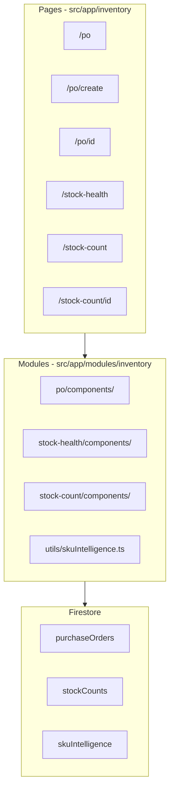

# Inventory Management Enhancement Plan

## Current Architecture

The inventory system follows this structure:

- **Pages**: `src/app/inventory/[feature]/page.tsx` - thin async server components that fetch data
- **Modules**: `src/app/modules/inventory/[feature]/components/` - client components with business logic
- **APIs**: `src/app/modules/inventory/utils/inventoryAPI.ts` (writes), `store/utils/InventoryApi.ts` (reads)
- **Data**: Firestore document per user with `store` object containing arrays for items, categories, suppliers, transactions



---

## Step 1: Purchase Order (PO) System

### 1.1 New Pages

| Route                        | File                                         | Purpose                  |
| ---------------------------- | -------------------------------------------- | ------------------------ |
| `/inventory/po`              | `src/app/inventory/po/page.tsx`              | PO list with filters     |
| `/inventory/po/create`       | `src/app/inventory/po/create/page.tsx`       | Multi-step PO creation   |
| `/inventory/po/[id]`         | `src/app/inventory/po/[id]/page.tsx`         | PO detail, edit, receive |
| `/inventory/po/reorder-list` | `src/app/inventory/po/reorder-list/page.tsx` | Daily reorder items list |

### 1.2 New Module Structure

```
src/app/modules/inventory/po/
├── components/
│   ├── POList.tsx              # Main PO listing table
│   ├── PODetail.tsx            # Single PO view with actions
│   ├── POCreateWizard.tsx      # Multi-step creation form
│   ├── POItemsTable.tsx        # Items grouped by supplier
│   ├── POReceiveForm.tsx       # Mark items as received
│   ├── DailyReorderList.tsx    # Tracked/Untracked items view
│   ├── POStatusBadge.tsx       # Status indicator component
│   └── SupplierGroupCard.tsx   # Supplier group with items
└── utils/
    └── poApi.ts                # PO-specific API functions
```

### 1.3 Database Schema (Firestore)

Add to user's inventory document:

```typescript
// New collection: purchaseOrders (array in store object)
interface PurchaseOrder {
  id: string; // "PO-2026-001"
  name: string;
  type: "one-time" | "recurring";
  frequency?: "daily" | "weekly" | "monthly";
  executionDay?: string | number;
  autoAddReorderItems: boolean;
  status:
    | "draft"
    | "scheduled"
    | "pending-approval"
    | "approved"
    | "sent"
    | "received"
    | "partially-received";
  trackedItemIds: string[];
  items: POItem[];
  totalAmount: number;
  createdAt: string;
  createdBy: string;
  approvedAt?: string;
  approvedBy?: string;
  sentAt?: string;
  receivedAt?: string;
}

interface POItem {
  itemId: string;
  itemName: string;
  sku: string;
  supplierId: string;
  supplierName: string;
  quantity: number;
  unitPrice: number;
  amount: number;
  receivedQty?: number;
  qualityOk?: boolean;
  receiveNotes?: string;
}
```

Add to existing items:

```typescript
// Add to each inventory item
trackedInPOId: string | null; // Which recurring PO tracks this item
```

### 1.4 API Functions to Add

In `src/app/modules/inventory/po/utils/poApi.ts`:

```typescript
// Create
export async function createPurchaseOrder(po: PurchaseOrder): Promise<boolean>;

// Read
export async function getPurchaseOrders(): Promise<PurchaseOrder[]>;
export async function getPurchaseOrderById(id: string): Promise<PurchaseOrder>;

// Update
export async function updatePurchaseOrder(po: PurchaseOrder): Promise<boolean>;
export async function updatePOStatus(
  id: string,
  status: string,
  metadata?: object,
): Promise<boolean>;

// Receive
export async function receivePOItems(
  id: string,
  receivedItems: ReceivedItem[],
): Promise<boolean>;

// Helpers
export async function getItemsAtReorderLevel(): Promise<Item[]>;
export async function getTrackedItems(poId: string): Promise<Item[]>;
export async function getUntrackedItemsAtReorder(): Promise<Item[]>;
```

### 1.5 Dashboard Widget

Add to [store.tsx](src/app/modules/inventory/store/components/store.tsx):

- "Pending POs" metric card showing count of POs awaiting approval
- Quick action to view/approve pending POs

---

## Step 2: SKU Intelligence Algorithm

### 2.1 New Module Structure

```
src/app/modules/inventory/intelligence/
├── utils/
│   ├── skuIntelligence.ts      # Core algorithm functions
│   ├── supplierScoring.ts      # Supplier score calculations
│   └── triggers.ts             # Event handlers for recalculation
└── components/
    └── SKUInsightsCard.tsx     # Optional: Show insights on item detail
```

### 2.2 Database Schema

Add to user's inventory document:

```typescript
// New: skuIntelligence (object keyed by itemId)
interface SKUIntelligence {
  [itemId: string]: {
    avgDailyUsage: number;
    usageLast30Days: { date: string; qty: number }[];
    reorderPoint: number;
    suggestedOrderQty: number;
    lastOrderDate: string | null;
    avgLeadTimeDays: number;
    leadTimeHistory: { poId: string; days: number }[];
    lastPurchasePrice: number;
    priceHistory: { date: string; supplierId: string; price: number }[];
    preferredSupplierId: string;
    supplierScores: {
      supplierId: string;
      priceScore: number;
      reliabilityScore: number;
      combinedScore: number;
    }[];
    lastCalculated: string;
  };
}

// New: supplierMetrics (for reliability tracking)
interface SupplierMetrics {
  [supplierId: string]: {
    deliveries: {
      poId: string;
      expectedDate: string;
      actualDate: string;
      orderedQty: number;
      receivedQty: number;
      qualityOk: boolean;
    }[];
    avgLeadTimeDays: number;
    reliabilityScore: number;
  };
}
```

### 2.3 Algorithm Functions

In `src/app/modules/inventory/intelligence/utils/skuIntelligence.ts`:

```typescript
// Usage calculation
export function calculateAvgDailyUsage(
  itemId: string,
  transactions: Transaction[],
): number;

// Reorder calculations
export function calculateReorderPoint(
  avgDailyUsage: number,
  avgLeadTimeDays: number,
  buffer: number,
): number;
export function calculateSuggestedOrderQty(
  avgDailyUsage: number,
  leadTime: number,
  currentStock: number,
): number;

// Supplier scoring
export function calculatePriceScore(
  supplierAvgPrice: number,
  lowestPrice: number,
): number;
export function calculateReliabilityScore(deliveries: Delivery[]): number;
export function selectPreferredSupplier(
  itemId: string,
  supplierScores: SupplierScore[],
): string;

// Batch recalculation (for cron job / manual trigger)
export async function recalculateAllSKUIntelligence(): Promise<void>;

// Trigger handlers
export function onStockTransaction(
  itemId: string,
  transaction: Transaction,
): Promise<void>;
export function onPOReceived(po: PurchaseOrder): Promise<void>;
```

### 2.4 Integration Points

Update existing functions to trigger recalculation:

1. **On Stock In/Out** - Update `avgDailyUsage`, `lastPurchasePrice`, `priceHistory`

- Modify `saveInventoryItem()` in [inventoryAPI.ts](src/app/modules/inventory/utils/inventoryAPI.ts)
- Modify `addNewTransaction()` in same file

1. **On PO Received** - Update `avgLeadTimeDays`, supplier `reliabilityScore`

- Add to new `receivePOItems()` function

1. **Daily Batch** - Recalculate `reorderPoint`, `suggestedOrderQty`, `preferredSupplierId`

- Create API route `/api/cron/recalculate-sku` for scheduled execution

---

## Step 3: Lead Time Tracking

Covered in Step 2. Lead time is captured when:

1. PO is created (expectedDate = sentAt + supplier's avgLeadTimeDays)
2. PO is received (actualDate recorded)
3. Difference stored in `leadTimeHistory`
4. `avgLeadTimeDays` recalculated

No additional pages needed. Data flows through PO system.

---

## Step 4: Stock Health Section (Expiry + Dead Stock)

### 4.1 New Pages

| Route                     | File                                      | Purpose                     |
| ------------------------- | ----------------------------------------- | --------------------------- |
| `/inventory/stock-health` | `src/app/inventory/stock-health/page.tsx` | Tabbed view with 3 sections |

### 4.2 New Module Structure

```
src/app/modules/inventory/stock-health/
├── components/
│   ├── StockHealth.tsx         # Main component with tabs
│   ├── ExpiringSoon.tsx        # Items expiring in 7/15/30 days
│   ├── SlowMoving.tsx          # Items not used in 30/60/90 days
│   ├── Overstocked.tsx         # Items above max level
│   └── StockHealthFilters.tsx  # Shared filter component
└── utils/
    └── stockHealthApi.ts       # Query functions
```

### 4.3 Database Schema Changes

Update inventory item structure - add fields to existing items:

```typescript
// Add to each inventory item in store.items[]
expiryDate?: string;             // ISO date string
maxStockLevel?: number;          // For overstocked detection
lastStockOutDate?: string;       // Updated on Stock Out transaction
```

Optional: Add batch tracking for FIFO:

```typescript
// New: itemBatches array in store object
interface ItemBatch {
  id: string;
  itemId: string;
  batchNumber: string;
  quantity: number;
  expiryDate: string;
  receivedDate: string;
  poId: string;
}
```

### 4.4 API Functions

In `src/app/modules/inventory/stock-health/utils/stockHealthApi.ts`:

```typescript
export async function getExpiringSoonItems(days: number): Promise<Item[]>;
export async function getSlowMovingItems(idleDays: number): Promise<Item[]>;
export async function getOverstockedItems(): Promise<Item[]>;
export async function updateItemExpiryDate(
  itemId: string,
  expiryDate: string,
): Promise<boolean>;
export async function updateItemMaxStockLevel(
  itemId: string,
  maxLevel: number,
): Promise<boolean>;
```

### 4.5 Dashboard Integration

Add to [store.tsx](src/app/modules/inventory/store/components/store.tsx):

- "Expiring Soon" metric card with count
- "Slow Moving" metric card with count
- Alert banner if items expiring within 7 days

---

## Step 5: Physical Count & Discrepancy Alerts

### 5.1 New Pages

| Route                         | File                                          | Purpose                       |
| ----------------------------- | --------------------------------------------- | ----------------------------- |
| `/inventory/stock-count`      | `src/app/inventory/stock-count/page.tsx`      | List of stock counts          |
| `/inventory/stock-count/new`  | `src/app/inventory/stock-count/new/page.tsx`  | Start new count               |
| `/inventory/stock-count/[id]` | `src/app/inventory/stock-count/[id]/page.tsx` | Count entry & variance review |

### 5.2 New Module Structure

```
src/app/modules/inventory/stock-count/
├── components/
│   ├── StockCountList.tsx      # List of all counts with status
│   ├── CountSheet.tsx          # Entry form for physical count
│   ├── VarianceReport.tsx      # Shows discrepancies
│   ├── AdjustmentApproval.tsx  # Manager approval flow
│   └── ReasonCodeSelect.tsx    # Dropdown for variance reasons
└── utils/
    └── stockCountApi.ts        # Stock count API functions
```

### 5.3 Database Schema

Add new collection to store object:

```typescript
// New: stockCounts array in store object
interface StockCount {
  id: string; // "SC-2026-001"
  date: string;
  category?: string; // Optional filter
  status:
    | "in-progress"
    | "pending-review"
    | "pending-approval"
    | "completed"
    | "rejected";
  countedBy: string;
  items: StockCountItem[];
  createdAt: string;
  completedAt?: string;
  approvedBy?: string;
  approvedAt?: string;
}

interface StockCountItem {
  itemId: string;
  itemName: string;
  sku: string;
  systemQty: number;
  actualQty: number | null; // null until counted
  variance: number;
  variancePercent: number;
  varianceValue: number;
  reasonCode?:
    | "counting-error"
    | "damage"
    | "theft"
    | "unrecorded-usage"
    | "unrecorded-receipt"
    | "other";
  notes?: string;
  requiresApproval: boolean; // true if variance > threshold
}

// New: stockAdjustments array for audit log
interface StockAdjustment {
  id: string;
  stockCountId: string;
  date: string;
  itemId: string;
  systemQtyBefore: number;
  actualQty: number;
  variance: number;
  reasonCode: string;
  notes: string;
  adjustedBy: string;
  approvedBy?: string;
  approvedAt?: string;
}
```

### 5.4 API Functions

In `src/app/modules/inventory/stock-count/utils/stockCountApi.ts`:

```typescript
// Stock Count CRUD
export async function createStockCount(category?: string): Promise<StockCount>;
export async function getStockCounts(): Promise<StockCount[]>;
export async function getStockCountById(id: string): Promise<StockCount>;
export async function updateStockCountItem(
  countId: string,
  itemId: string,
  actualQty: number,
): Promise<boolean>;
export async function completeStockCount(id: string): Promise<boolean>;

// Variance handling
export async function submitForApproval(
  countId: string,
  variances: VarianceSubmission[],
): Promise<boolean>;
export async function approveAdjustment(
  countId: string,
  itemId: string,
): Promise<boolean>;
export async function rejectAdjustment(
  countId: string,
  itemId: string,
  reason: string,
): Promise<boolean>;

// Apply adjustments
export async function applyStockAdjustments(countId: string): Promise<boolean>;
```

### 5.5 Alert Configuration

Add constants for thresholds:

```typescript
// src/app/modules/inventory/stock-count/utils/constants.ts
export const VARIANCE_PERCENT_THRESHOLD = 5; // Alert if variance > 5%
export const VARIANCE_VALUE_THRESHOLD = 500; // Alert if variance value > 500
```

### 5.6 Dashboard Integration

Add to [store.tsx](src/app/modules/inventory/store/components/store.tsx):

- "Pending Counts" metric showing counts awaiting approval
- Quick action to start new stock count

---

## Implementation Order

```mermaid
gantt
    title Implementation Phases
    dateFormat X
    axisFormat %s

    section Phase1
    Database Schema Updates           :a1, 0, 1
    Types and Interfaces              :a2, 1, 2

    section Phase2_PO
    PO API Functions                  :b1, 2, 4
    PO Components                     :b2, 4, 7
    PO Pages                          :b3, 7, 9

    section Phase3_Intelligence
    SKU Intelligence Utils            :c1, 9, 11
    Integration Triggers              :c2, 11, 13

    section Phase4_StockHealth
    Stock Health API                  :d1, 13, 14
    Stock Health Components           :d2, 14, 16
    Stock Health Page                 :d3, 16, 17

    section Phase5_StockCount
    Stock Count API                   :e1, 17, 19
    Stock Count Components            :e2, 19, 22
    Stock Count Pages                 :e3, 22, 24

    section Phase6_Dashboard
    Dashboard Updates                 :f1, 24, 26
    Testing and Polish                :f2, 26, 28
```



**Recommended order:**

1. Database schema updates and TypeScript interfaces
2. Step 1: PO System (foundation for other features)
3. Step 2 & 3: SKU Intelligence + Lead Time (depends on PO receiving)
4. Step 4: Stock Health (independent, can parallelize)
5. Step 5: Physical Count (independent, can parallelize)
6. Dashboard integration and testing

---

## Files to Modify

| File                                                                                                           | Changes                                        |
| -------------------------------------------------------------------------------------------------------------- | ---------------------------------------------- |
| [src/types/inventory.ts](src/types/inventory.ts)                                                               | Add PO, StockCount, SKUIntelligence interfaces |
| [src/app/modules/inventory/utils/inventoryAPI.ts](src/app/modules/inventory/utils/inventoryAPI.ts)             | Add trigger calls for SKU intelligence         |
| [src/app/modules/inventory/store/utils/InventoryApi.ts](src/app/modules/inventory/store/utils/InventoryApi.ts) | Add functions to fetch new data collections    |
| [src/app/modules/inventory/store/components/store.tsx](src/app/modules/inventory/store/components/store.tsx)   | Add new metric cards and dashboard widgets     |
| [src/app/inventory/layout.tsx](src/app/inventory/layout.tsx)                                                   | No changes needed (shared layout works)        |

---

## New Files to Create

**Pages (9 new pages):**

- `src/app/inventory/po/page.tsx`
- `src/app/inventory/po/create/page.tsx`
- `src/app/inventory/po/[id]/page.tsx`
- `src/app/inventory/po/reorder-list/page.tsx`
- `src/app/inventory/stock-health/page.tsx`
- `src/app/inventory/stock-count/page.tsx`
- `src/app/inventory/stock-count/new/page.tsx`
- `src/app/inventory/stock-count/[id]/page.tsx`

**Modules (3 new module folders with ~20 component files):**

- `src/app/modules/inventory/po/` (7 components + 1 API file)
- `src/app/modules/inventory/intelligence/` (3 util files + 1 component)
- `src/app/modules/inventory/stock-health/` (5 components + 1 API file)
- `src/app/modules/inventory/stock-count/` (5 components + 1 API file)
